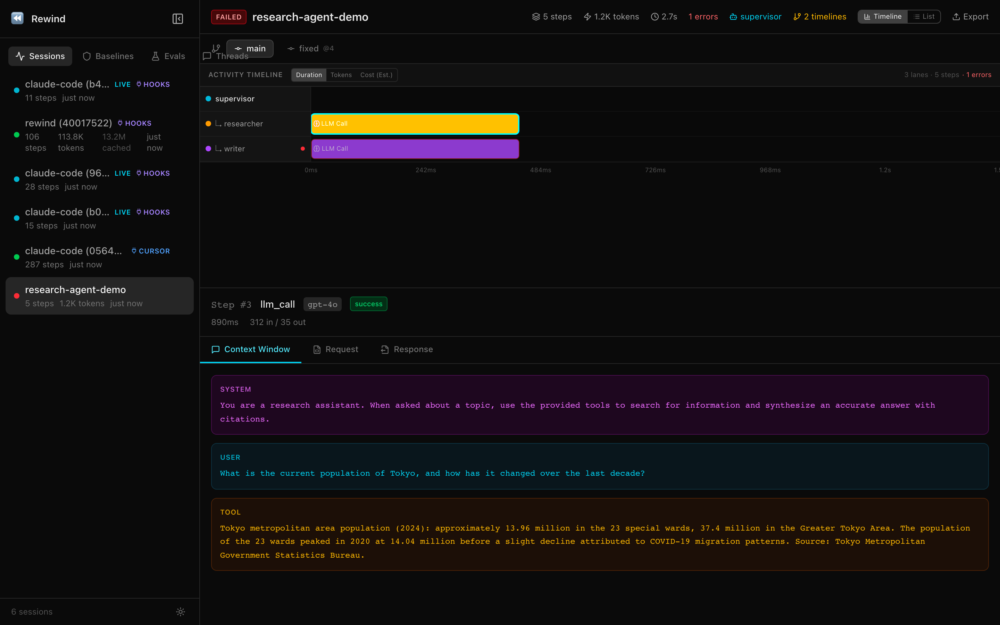
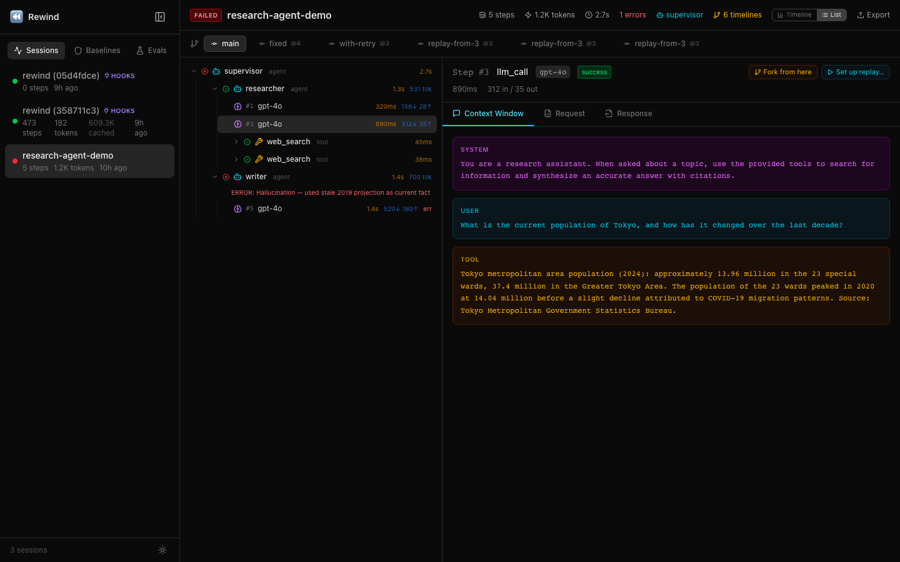
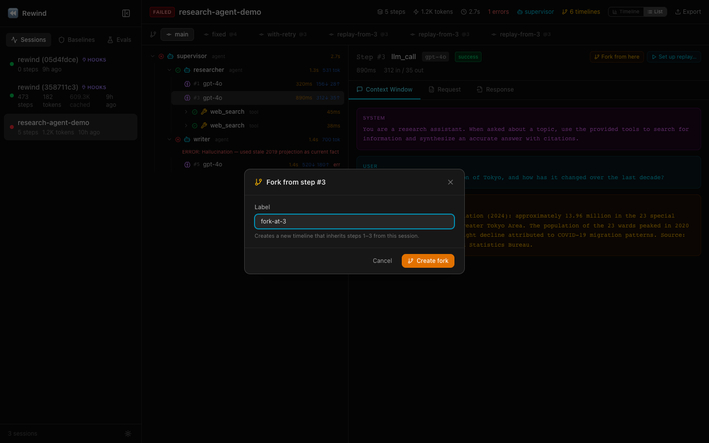
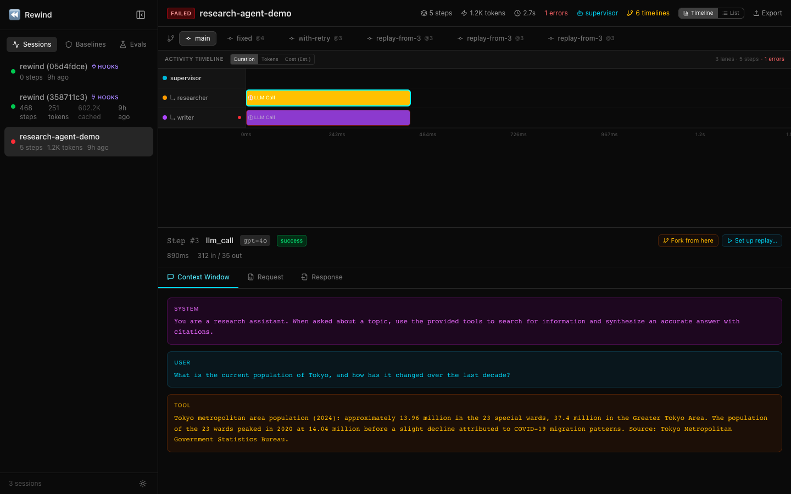
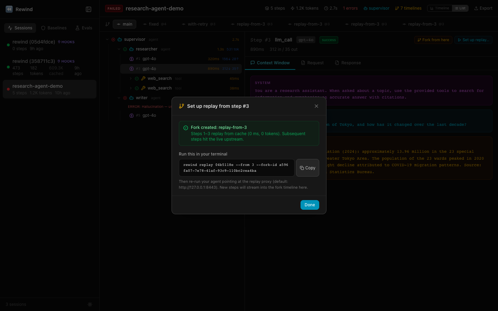
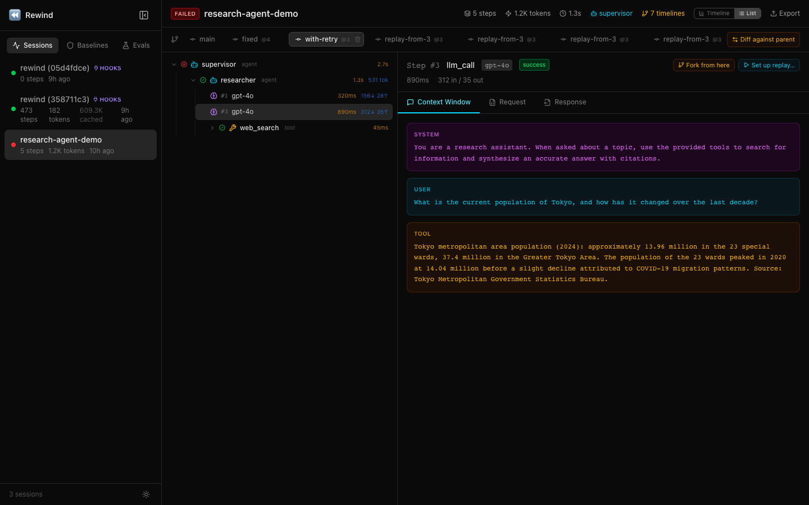
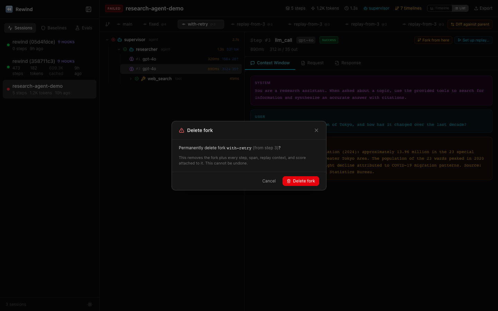

# Web UI -- Browser-Based Dashboard

Rewind is a time-travel debugger for AI agents that records every LLM call for inspection, forking, replay, and diffing. The web UI provides a browser-based dashboard to explore recorded sessions, visualize agent activity across time, inspect context windows, diff timelines, and watch live recordings.

<p align="center">
  
</p>

## Getting Started

Run `rewind web` and open `http://localhost:4800`:

```bash
rewind web [--port 4800]
```

To start recording with the live web dashboard:

```bash
rewind record --web
```

## Key Features

- **Activity Timeline** -- Horizontal swim-lane visualization where each agent or tool type gets its own lane. Steps rendered as duration bars showing relative timing. Zoom, pan, full keyboard navigation, and per-lane analytics on click.
- **Timeline / List toggle** -- Switch between the visual activity timeline and the classic step-by-step list view.
- **Multi-metric axis** -- Toggle bar widths between duration, token count, and estimated cost.
- **Session explorer** -- Browse all recorded sessions with stats.
- **Step list** -- Walk through each step with status icons, timing, and token counts.
- **Context window viewer** -- See the exact context window at each step: every message, system prompt, and tool response the model saw.
- **Fork & Replay in the browser** -- Fork any session at any step, then either navigate into the new timeline or copy a `rewind replay` command that streams new steps back into that same fork. See [Fork & Replay](#fork--replay).
- **Diff against parent** -- One-click visual diff of any fork against its parent timeline.
- **Delete forks** -- Destructive hard-delete with invariant checks (can't delete root, forks with children, or forks referenced by baselines or active replays).
- **Visual diff** -- Timeline diff visualization with color-coded bars (Same / Modified / LeftOnly / RightOnly) and a side-by-side comparison table.
- **WebSocket live** -- Watch recordings in real-time as your agent runs via WebSocket streaming, with auto-follow mode.

## Fork & Replay

Rewind's core workflow — branch the timeline at a step, re-run from there — is a first-class in-browser action. You get the same semantics as `rewind fork` / `rewind replay` on the CLI, but without leaving the session you're inspecting.

### Fork from any step

Click a step in the list or timeline view. In the step-detail header, two buttons appear: **Fork from here** and **Set up replay…**.

<p align="center">
  
</p>

**Fork from here** → opens a modal, you pick a label (default `fork-at-{N}`), submit. The UI creates the fork server-side and navigates you to the new timeline. Steps 1–N are inherited from the parent; step N+1 onward is yours to fill in.

<p align="center">
  
</p>

The same affordance is available on the **Activity Timeline** — hover any bar and fork/replay icons appear inside the bar (and are revealed on keyboard focus for tab-only users).

<p align="center">
  
</p>

### Set up a replay

**Set up replay…** creates the fork server-side and then hands you a shell command to start the replay proxy externally:

```
rewind replay <session-prefix> --from <N> --fork-id <new-fork-id>
```

<p align="center">
  
</p>

Copy the command, run it in your terminal, then re-run your agent against `http://127.0.0.1:8443`. New steps stream into the fork timeline you're already watching in the browser. The `--fork-id` flag guarantees the CLI reuses the fork the UI created — no "double-fork" where live steps land on a timeline you can't see. (See [replay-and-forking.md](replay-and-forking.md) for the full workflow.)

### Diff against parent

When you're viewing any non-root timeline, the TimelineSelector shows a **Diff against parent** button. One click navigates to the diff view with `left=parent, right=active` pre-selected. The URL hash (`#/diff/{session}/{parent}/{fork}`) is shareable and bookmarkable.

<p align="center">
  
</p>

### Delete a fork

Hover a fork pill in the TimelineSelector → trash icon appears → confirm. The delete is hard (no undo) and enforces these invariants up front, so you never silently lose data:

- Root timelines cannot be deleted.
- Forks with child forks cannot be deleted — delete the children first.
- Forks referenced by a baseline cannot be deleted — delete the baseline first.
- Forks with an active replay context cannot be deleted — release the context first.

<p align="center">
  
</p>

Each invariant returns a specific message so you see exactly *why* the delete was blocked, not just that it failed. Dependent data (steps, spans, replay contexts, step counters, timeline scores) is cleared in a single transaction.

## Keyboard accessibility

Every interactive element in the fork/replay flow is keyboard-reachable:

- Fork/replay icons on Activity Timeline bars respond to `group-focus-within` — tab onto a bar and the icons appear.
- Trash icons on fork pills follow the same pattern.
- The delete confirmation dialog grabs focus on open (Cancel is the default target — safer for destructive actions) and restores focus to the trigger on close.

## Everything Embedded in a Single Binary

The entire web UI is embedded in the single Rewind binary -- no Docker, no Node.js runtime needed. Just run `rewind web` and everything works out of the box.
